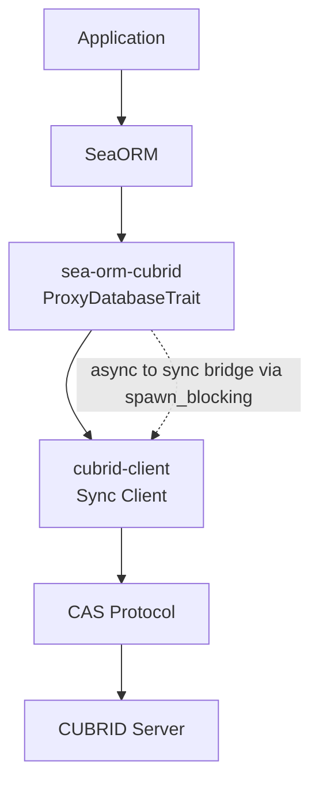
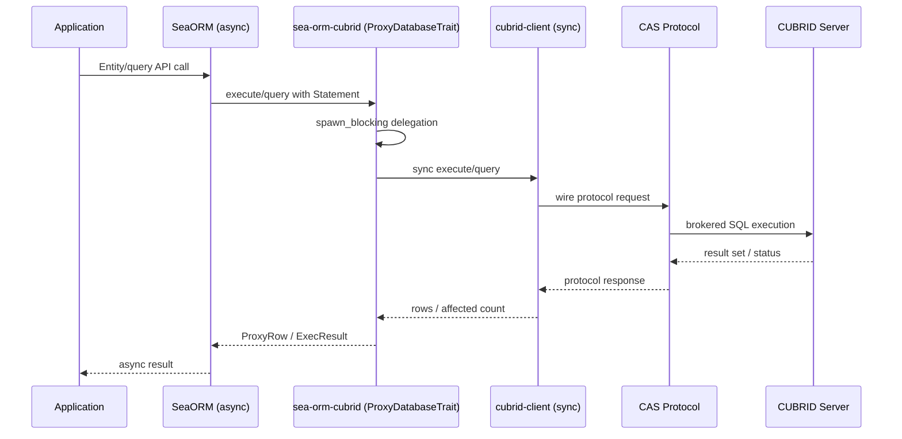

# sea-orm-cubrid

<!-- BADGES:START -->
[](https://crates.io/crates/sea-orm-cubrid)
[](https://github.com/cubrid-labs/sea-orm-cubrid/actions/workflows/ci.yml)
[](https://github.com/cubrid-labs/sea-orm-cubrid)
[](LICENSE)
[](https://github.com/cubrid-labs/sea-orm-cubrid)
<!-- BADGES:END -->

SeaORM backend crate for CUBRID via SeaORM's `ProxyDatabaseTrait`.

## Installation

```toml
[dependencies]
sea-orm = { version = "1", features = ["proxy"] }
sea-orm-cubrid = "0.1"
```

## Quick Start

```rust,no_run
use sea_orm::{EntityTrait, DbErr};

#[tokio::main]
async fn main() -> Result<(), DbErr> {
    let db = sea_orm_cubrid::connect("cubrid://dba:@localhost:33000/demodb").await?;

    // Use SeaORM as usual.
    // let models = cake::Entity::find().all(&db).await?;

    db.ping().await?;
    Ok(())
}
```

## Architecture

`sea-orm-cubrid` does not fork SeaORM. It adapts `cubrid-tokio` into SeaORM's proxy backend.





- SeaORM SQL generation uses `DbBackend::MySql` for CUBRID-compatible SQL.
- `CubridProxy` converts `Statement` values and query result rows.
- `tokio::sync::Mutex` protects shared async client state.

## Type Mapping

| SeaQuery `Value` | CUBRID protocol `Value` | Notes |
|---|---|---|
| `Bool(Some(v))` | `Bool(v)` | CUBRID stores BOOLEAN semantics over integer types |
| `Int(Some(v))` | `Int(v)` | direct |
| `BigInt(Some(v))` | `Long(v)` | direct |
| `Float(Some(v))` | `Float(v)` | direct |
| `Double(Some(v))` | `Double(v)` | direct |
| `String(Some(v))` | `String(v)` | direct |
| `Bytes(Some(v))` | `Bytes(v)` | direct |
| null variants | `Null` | mapped to protocol null |

## CUBRID Limitations

- No `RETURNING` support on DML statements
- No native JSON type
- No native BOOLEAN type (modeled via numeric values)

## FAQ

### Why does this use `DbBackend::MySql`?

SeaORM and SeaQuery already provide robust MySQL SQL generation, which is the closest backend family to CUBRID syntax for common ORM operations.

### Do I need a patched SeaORM?

No. This crate uses the public proxy extension pattern from SeaORM.

### Does this crate include live-database tests?

No. Test coverage is offline and deterministic.

## Ecosystem

| Package | Description | Language |
|:---|:---|:---|
| [pycubrid](https://github.com/cubrid-labs/pycubrid) | Python DB-API 2.0 driver | Python |
| [sqlalchemy-cubrid](https://github.com/cubrid-labs/sqlalchemy-cubrid) | SQLAlchemy 2.0 dialect | Python |
| [cubrid-client](https://github.com/cubrid-labs/cubrid-client) | TypeScript CAS client | TypeScript |
| [drizzle-cubrid](https://github.com/cubrid-labs/drizzle-cubrid) | Drizzle ORM dialect | TypeScript |
| [cubrid-go](https://github.com/cubrid-labs/cubrid-go) | Go database/sql driver + GORM | Go |
| [gorm-cubrid](https://github.com/cubrid-labs/gorm-cubrid) | GORM dialect for CUBRID | Go |
| [cubrid-rs](https://github.com/cubrid-labs/cubrid-rs) | Native Rust driver (sync + async) | Rust |
| [cubrid-cookbook](https://github.com/cubrid-labs/cubrid-cookbook) | examples | Multi |
| [cubrid-benchmark](https://github.com/cubrid-labs/cubrid-benchmark) | Multi-language benchmark suite | Multi |
