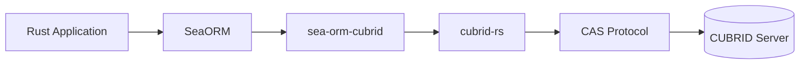
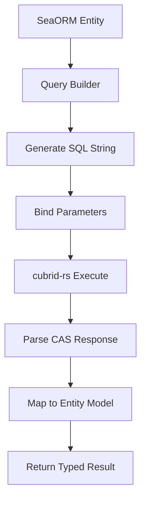

# Performance

Performance characteristics and optimization guidance for the sea-orm-cubrid SeaORM backend.

## Overview



sea-orm-cubrid provides a SeaORM backend for CUBRID, built on top of the `cubrid-rs` driver.
It translates SeaORM's query builder output into CUBRID-compatible SQL and manages the connection
lifecycle through the async `cubrid-rs` driver.

## Performance Characteristics



### ORM Overhead Layers

| Layer | Overhead | Notes |
|-------|----------|-------|
| Entity definition | Compile-time only | Zero runtime cost (derive macros) |
| Query building | Minimal | String concatenation + parameter binding |
| SQL generation | Minimal | CUBRID SQL dialect differences handled at compile time |
| Result mapping | Low | `FromQueryResult` trait, column-by-column extraction |
| Connection management | None | Delegates entirely to cubrid-rs |

### Expected Performance Profile

- **Query building**: Negligible overhead vs raw SQL (microseconds)
- **Result mapping**: ~5-15% overhead vs raw `cubrid-rs` due to `FromQueryResult` trait
- **Transaction management**: No additional overhead (pass-through to driver)

## Benchmark Results

> **Status**: Benchmarks planned — blocked on cubrid-rs criterion suite integration.

Planned benchmark comparisons:
- SeaORM CRUD vs raw cubrid-rs queries
- SeaORM batch operations vs manual transaction loops
- Connection pool throughput under concurrent load

Benchmark environment details will be available once criterion-based benchmarks are integrated.

## Optimization Tips

1. **Use `find_by_id`** instead of building filter queries manually — it generates optimal SQL
2. **Batch inserts with `insert_many`**: Reduces round-trips to the database
3. **Select only needed columns**: Use `.select_only().column(...)` to avoid fetching unnecessary data
4. **Transactions for writes**: Wrap multiple writes in `txn.begin()` / `txn.commit()`
5. **Release builds**: Always benchmark with `--release` flag
6. **Connection pooling**: SeaORM's `Database::connect()` creates a pool by default

## Running Benchmarks

Once criterion benchmarks are integrated in cubrid-rs:

```bash
# Run all benchmarks
cargo bench

# Run tests in release mode (current option)
cargo test --release

# Run with specific features
cargo test --release --features runtime-tokio-rustls
```

## Related

- [cubrid-benchmark](https://github.com/cubrid-labs/cubrid-benchmark) — Multi-language benchmark suite
- [cubrid-rs](https://github.com/cubrid-labs/cubrid-rs) — Underlying Rust CUBRID driver
