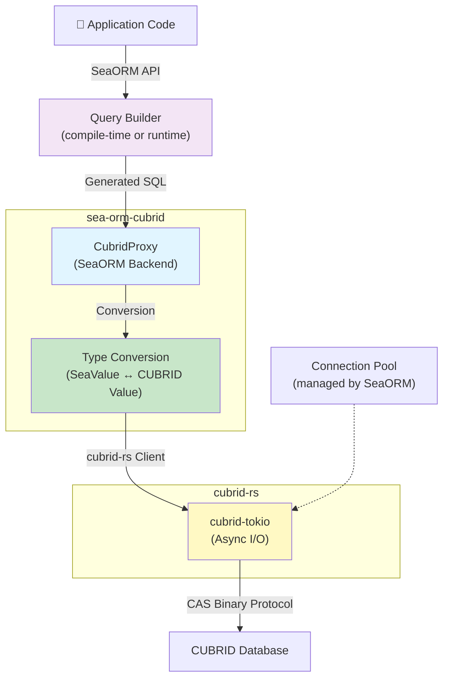

# Performance

This document describes the performance characteristics of `sea-orm-cubrid`, the SeaORM backend for CUBRID built on top of `cubrid-rs`.

## Overview

`sea-orm-cubrid` provides a **high-level ORM abstraction** over the `cubrid-rs` driver. Performance is influenced by:

1. **Underlying `cubrid-rs` protocol efficiency** (pure Rust, zero-copy parsing)
2. **SeaORM query builder compilation overhead** (runtime code generation)
3. **Async runtime considerations** (Tokio event loop scheduling)
4. **ORM abstraction layers** (type conversion, trait resolution)



## Performance Characteristics

### Latency Profile

| Operation | Latency | Notes |
|-----------|---------|-------|
| **Find (SELECT)** | Query compilation (0.1–1ms) + database processing | Static queries are faster; dynamic queries compile at runtime |
| **Insert** | Minimal overhead over cubrid-rs | Simple type conversions (SeaValue → CUBRID Value) |
| **Update** | Minimal overhead over cubrid-rs | Comparable to Insert |
| **Delete** | Minimal overhead over cubrid-rs | Usually fastest (no large result sets) |
| **Relationship Eager Load** | N+1 queries by default | Use `.find().join()` or explicit `.load_related()` to optimize |

### Memory Usage

| Component | Memory Profile |
|-----------|-----------------|
| **Query Builder** | ~1–2 KB per query (depends on complexity) |
| **DatabaseConnection** | ~10–20 KB (connection state + pool metadata) |
| **ORM Entity** | Varies per entity (same as in-memory Rust struct) |
| **Result Set** | Streamed when possible; no full materialization |

### Async Runtime Considerations

- **Tokio overhead**: Small (~microseconds per task switch) compared to database latency
- **Concurrent queries**: All I/O is async; thousands of concurrent requests are possible
- **Blocking code in async context**: Avoid sync operations; use `tokio::task::spawn_blocking` if necessary

### ORM Overhead Layers


## Optimization Tips

### 1. Use Eager Loading for Relationships

```rust
use sea_orm::{RelationTrait, Select};

// ❌ N+1 queries (slow)
let posts = Post::find().all(&db).await?;
for post in posts {
    let comments = post.find_related(Comment).all(&db).await?;
}

// ✅ Single join query
use sea_orm::QuerySelect;
let posts = Post::find()
    .find_with_related(Comment)
    .all(&db)
    .await?;
```

### 2. Use Static Queries Where Possible

```rust
// ✅ Static query (compiled at build time)
let users = User::find().all(&db).await?;

// Dynamic queries compile at runtime (small overhead)
let users = User::find()
    .filter(user::Column::Status.eq("active"))
    .all(&db)
    .await?;
```

### 3. Batch Insert/Update

```rust
use sea_orm::{Set, ActiveValue};

// Batch insert (more efficient than individual inserts)
let models = vec![
    user::ActiveModel { name: Set("Alice".into()), ..Default::default() },
    user::ActiveModel { name: Set("Bob".into()), ..Default::default() },
];
User::insert_many(models).exec(&db).await?;

// Batch update
User::update_many()
    .set(user::ActiveModel { status: Set("inactive".into()) })
    .filter(user::Column::LastLogin.lt(now - Duration::days(90)))
    .exec(&db)
    .await?;
```

### 4. Use Pagination for Large Result Sets

```rust
use sea_orm::PaginatorTrait;

let paginator = User::find()
    .order_by_asc(user::Column::Id)
    .paginate(&db, 100); // 100 per page

let num_pages = paginator.num_pages().await?;

for page in 1..=num_pages {
    let page = paginator.fetch_page(page - 1).await?;
    // Process page...
}
```

### 5. Connection Pool Sizing

SeaORM manages connection pooling. Configure via `ConnectOptions`:

```rust
use sea_orm::ConnectOptions;
use std::time::Duration;

let mut opt = ConnectOptions::new("cubrid://dba@localhost:33000/demodb");
opt.max_connections(32)
   .min_connections(5)
   .connect_timeout(Duration::from_secs(10))
   .idle_timeout(Duration::from_secs(30));

let db = sea_orm::Database::connect(opt).await?;
```

### 6. Use Transactions Judiciously

```rust
// Transactions add overhead; use for consistency, not for every operation
let txn = db.begin().await?;

// Multiple operations in one transaction
Entity1::insert(model1).exec(&txn).await?;
Entity2::insert(model2).exec(&txn).await?;

txn.commit().await?; // All succeed or all fail
```

## Running Benchmarks

### Current Status (v0.1.0)

**Benchmarks planned — blocked on cubrid-rs criterion suite**. Once cubrid-rs adds Criterion benchmarks (v0.2.0), sea-orm-cubrid benchmarks will measure:
- ORM query builder compilation cost
- Overhead of type conversions (SeaValue ↔ CUBRID Value)
- Batch operation throughput (inserts, updates)
- Concurrent query performance
- Relationship loading strategies (eager vs. lazy)

### Setting Up Benchmarks (v0.2.0+)

Once cubrid-rs criterion suite is available:

```bash
# Run all benchmarks
cargo bench

# Run specific benchmark group
cargo bench -- --bench orm_query_builder
cargo bench -- --bench batch_operations

# Run with detailed output
cargo bench -- --verbose
```

### Manual Performance Testing (v0.1.0)

For now, use release mode tests:

```bash
# Run all tests in release mode
cargo test --release

# Run a specific test in release mode
cargo test --release test_find_throughput -- --ignored

# Profile with perf (Linux)
cargo build --release --bench my_bench
perf record -g ./target/release/my_bench
perf report
```

### External Benchmarks

See [`cubrid-benchmark`](https://github.com/cubrid-labs/cubrid-benchmark) for comparative benchmarks across:
- sea-orm-cubrid (SeaORM + cubrid-rs)
- Other CUBRID drivers (Python, Node.js, Go)
- Sea-ORM with other database backends

## Benchmark Environment

Benchmark environment details will be available once criterion-based benchmarks are integrated.

### Expected Setup (v0.2.0+)

- **Hardware**: AWS t4g.medium (ARM, 2 vCPU, 4 GB RAM) or equivalent
- **CUBRID**: Latest stable (11.4+)
- **SeaORM**: Latest stable
- **Network**: localhost (no network latency)
- **Workload**: Synthetic ORM operations (queries, inserts, updates, deletes)
- **Concurrency**: Single-threaded, then multi-threaded scalability

### Profiling Tools

- **Linux**: `perf`, `flamegraph`, `cargo-flamegraph`
- **All platforms**: `cargo-profiling` (profiling via bench feature)

## Related Documentation

- [API Reference](./API_REFERENCE.md) — SeaORM CUBRID backend API
- [Troubleshooting](./TROUBLESHOOTING.md) — Common issues and solutions
- [`cubrid-rs` Performance](https://github.com/cubrid-labs/cubrid-rs/blob/main/docs/PERFORMANCE.md) — Underlying driver performance
- [`cubrid-benchmark`](https://github.com/cubrid-labs/cubrid-benchmark) — Comparative benchmarks across drivers
