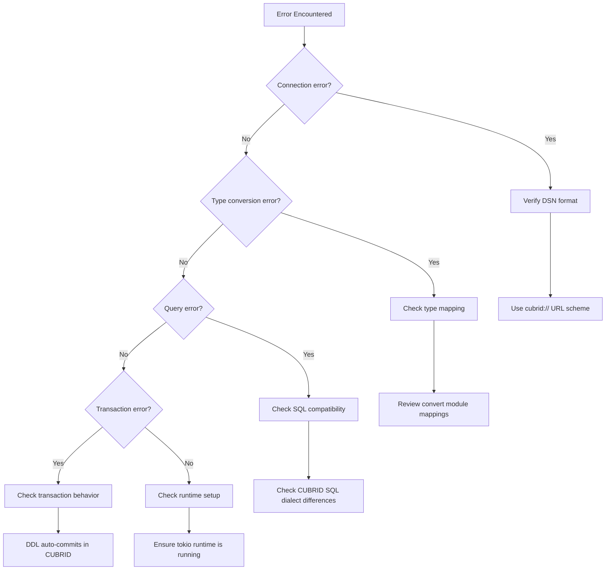

# Troubleshooting

Common issues and solutions for the SeaORM CUBRID backend.

## Diagnostic Flow



## Connection Issues

### Error: `DbErr::Conn` on startup

**Cause**: Invalid DSN or unreachable CUBRID server.

**Solution**:
```rust
// ✅ Correct DSN format
let db = sea_orm_cubrid::connect("cubrid://dba@localhost:33000/demodb").await?;

// ❌ Wrong — don't use JDBC-style strings
let db = sea_orm_cubrid::connect("jdbc:cubrid:localhost:33000:demodb:::").await?;
```

Verify the database is running:
```bash
docker run -d -p 33000:33000 -e CUBRID_DB=demodb cubrid/cubrid:11.2
sleep 15  # Wait for initialization
```

### Error: Connection refused

**Cause**: CUBRID broker not listening on the expected port.

**Solution**:
1. Default CUBRID broker port is `33000`
2. If using Docker, ensure port mapping is correct: `-p 33000:33000`
3. Check broker status: `cubrid broker status`

### Tokio runtime error

**Cause**: `sea-orm-cubrid` uses `cubrid-tokio` which requires a Tokio async runtime.

**Solution**: Ensure you're running inside a Tokio runtime:
```rust
#[tokio::main]
async fn main() -> Result<(), Box<dyn std::error::Error>> {
    let db = sea_orm_cubrid::connect("cubrid://dba@localhost:33000/demodb").await?;
    // ...
    Ok(())
}
```

## Type Conversion Issues

### Unsigned integers overflow

**Cause**: CUBRID has no unsigned integer types. Large `u32`/`u64` values that exceed `i32::MAX`/`i64::MAX` are converted to strings.

**Solution**: This is handled automatically by the conversion layer. Values within the signed range use native integer types; overflow values are serialized as strings.

### Date/time values returned as strings

**Expected behavior**: CUBRID's `Date`, `Time`, `Timestamp`, and `Datetime` values are converted to formatted strings in SeaORM:
- Date → `"YYYY-MM-DD"`
- Time → `"HH:MM:SS"`
- Timestamp → `"YYYY-MM-DD HH:MM:SS"`
- Datetime → `"YYYY-MM-DD HH:MM:SS.mmm"`

Parse these in your application as needed.

### NULL values

All `NULL` values from CUBRID are mapped to `SeaValue::String(None)`. When querying, handle `None` variants appropriately.

## Query Issues

### `last_insert_id` always returns 0

**Expected behavior**: CUBRID's CAS protocol doesn't return the last inserted ID via the execute result. The `ProxyExecResult.last_insert_id` is always `0`.

**Workaround**: Query the last inserted ID separately:
```rust
// After INSERT, query the auto-increment value
let result = db.query_one(Statement::from_string(
    DbBackend::MySql,
    "SELECT LAST_INSERT_ID()".to_owned(),
)).await?;
```

### SQL compatibility

SeaORM generates MySQL-compatible SQL because `sea-orm-cubrid` uses `DbBackend::MySql` as the proxy backend. Most MySQL SQL is compatible with CUBRID, but be aware of these differences:

- No `JSON` functions or operators
- No `RETURNING` clause
- No `ON CONFLICT` — use `ON DUPLICATE KEY UPDATE` instead
- Collection types (`SET`, `MULTISET`, `SEQUENCE`) are CUBRID-specific

## Transaction Issues

### DDL not rolling back

**Expected behavior**: CUBRID auto-commits DDL statements. Schema changes cannot be rolled back within a transaction.

### Transaction isolation

CUBRID supports 6 isolation levels with dual granularity (class-level and instance-level). The default is appropriate for most use cases.

## Build Issues

### Minimum Rust version

`sea-orm-cubrid` requires Rust 1.88+ due to transitive dependency requirements (specifically `time@0.3.47`). Use `rustup update stable` to ensure you have a compatible toolchain.

### Dependency resolution

This crate depends on the `cubrid-rs` workspace crates (`cubrid-protocol`, `cubrid-tokio`). If building from source, ensure the workspace is properly configured in `Cargo.toml`.

## Getting Help

1. Check the [README](../README.md) for basic setup
2. Review [API Reference](API_REFERENCE.md) for all available types and functions
3. Check [cubrid-rs documentation](https://github.com/cubrid-labs/cubrid-rs) for protocol-level issues
4. Open an issue on [GitHub](https://github.com/cubrid-labs/sea-orm-cubrid/issues)
